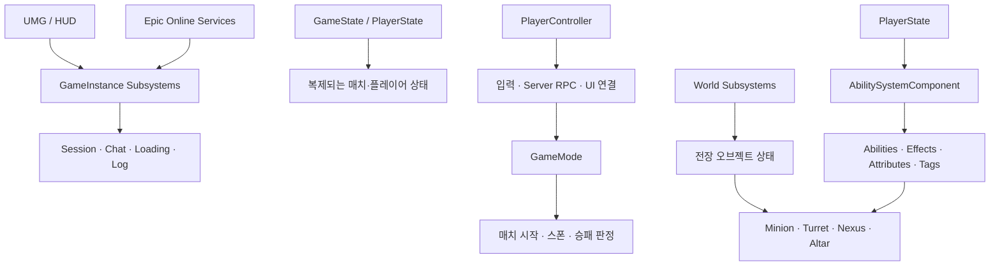

# FieryTale

> **Unreal Engine 5와 Gameplay Ability System을 기반으로 개발한 팀 기반 멀티플레이 3D AOS 게임**

FieryTale은 각기 다른 전투 스타일을 가진 영웅을 선택하고, 팀원과 함께 라인과 주요 오브젝트를 장악하여 상대 넥서스를 파괴하는 것을 목표로 하는 3D AOS 프로젝트입니다.

전투 시스템뿐 아니라 **EOS 세션 매칭, 로비와 캐릭터 선택, 네트워크 동기화, Seamless Travel, 어빌리티 기반 AI, 전장 구조물, 채팅 및 HUD**까지 하나의 멀티플레이 게임 흐름으로 구현하는 데 초점을 맞췄습니다.

## 프로젝트 개요

| 항목 | 내용 |
| --- | --- |
| 장르 | Multiplayer 3D AOS / MOBA |
| 엔진 | Unreal Engine 5.8 |
| 개발 언어 | C++, Blueprint |
| 온라인 백엔드 | Epic Online Services(EOS) |
| 기본 플레이 구조 | 팀 기반 라인전 → 오브젝트 전투 → 넥서스 파괴 |
| 카메라 | 3인칭 쿼터뷰 |
| 개발 형태 | 5인 팀 프로젝트 |

## 핵심 특징

### GAS 기반 전투

- 평타, 공격 스킬, 유틸 스킬, 궁극기를 공통 Gameplay Ability 구조로 구현
- `AbilitySystemComponent`, `AttributeSet`, `GameplayEffect`, `GameplayTag`를 활용한 상태 관리
- 체력, 보호막, 공격력, 이동 속도, 궁극기 게이지 등 전투 속성 동기화
- 쿨타임, 버프·디버프, 사망 및 피격 반응 처리
- 캐릭터별 무기·스킬 데이터를 Data Asset으로 분리해 확장 가능하도록 구성

### 온라인 멀티플레이

- EOS 기반 로그인 및 세션 생성·검색·참가
- RPC와 Replication을 통한 플레이어 상태 및 전투 결과 동기화
- 서버 권한 기반의 캐릭터 선택, 준비 상태, 매치 시작 판정
- Listen Server 플레이와 Dedicated Server 흐름을 고려한 구조
- Seamless Travel을 이용해 연결을 유지하며 로비에서 전장으로 이동

### AOS 전장과 AI

- 두 개의 라인, 중앙 점령 구역, 미니언 이동 경로로 구성된 대칭형 전장
- 미니언, 포탑, 넥서스, 중앙 제단 및 수풀 구현
- 탐색·이동·공격 행동을 어빌리티 단위로 캡슐화한 미니언 AI
- Navigation System과 Waypoint를 결합한 라인 이동
- 포탑 파괴 조건과 넥서스 활성화를 포함한 오브젝트 기반 승패 구조

### 게임 UI와 독립 시스템

- 메인 메뉴, 서버 브라우저, 로비, 캐릭터 선택 화면
- 체력, 스킬 쿨타임, 궁극기 게이지, 아군 상태, 구조물 상태 및 점수판
- 위치를 조정할 수 있는 커스터마이징 HUD 기반 구조
- 전체·팀·시스템 채널을 지원하도록 설계한 독립형 채팅 시스템
- 로딩 화면, 로그 및 전장 상태를 Subsystem으로 분리

### 연출

- Chaos Destruction과 Geometry Collection을 활용한 구조물 파괴
- Niagara 기반 투사체 및 충돌 이펙트
- 캐릭터별 애니메이션 몽타주와 피격·사망 연출

## 게임 진행 흐름


1. EOS 로그인 후 방을 생성하거나 기존 세션을 검색해 참가합니다.
2. 로비에서 캐릭터를 선택하고 모든 플레이어가 준비합니다.
3. 서버가 시작 조건을 판정한 뒤 플레이어 연결을 유지하며 전장으로 이동합니다.
4. 미니언과 중앙 제단을 활용해 전투 우위를 확보하고 상대 포탑을 파괴합니다.
5. 최종 오브젝트인 상대 넥서스를 파괴하면 매치가 종료됩니다.

## 시스템 아키텍처



### 주요 설계 방향

- 레벨 이동에도 유지되어야 하는 세션·채팅·로딩 기능은 `UGameInstanceSubsystem`으로 관리합니다.
- 매치 단위 전장 상태는 `UWorldSubsystem`으로 분리합니다.
- 플레이어가 캐릭터를 교체하거나 재스폰해도 유지할 GAS 데이터는 `APlayerState`가 소유합니다.
- 전투 판정과 로비 진행은 서버 권한으로 처리하고 클라이언트에는 필요한 결과를 복제합니다.
- 캐릭터와 스킬 에셋은 Soft Reference와 Data Asset을 사용해 결합도를 낮췄습니다.

## 주요 기술 스택

| 영역 | 기술 |
| --- | --- |
| Gameplay | Gameplay Ability System, Gameplay Tags, Gameplay Effects |
| Network | EOS, OnlineSubsystem, RPC, Replication, Seamless Travel |
| AI | AIController, Navigation System, NavMesh, Waypoint, Ability 기반 행동 |
| UI | UMG, Slate, 커스텀 HUD Layout Subsystem |
| Rendering / FX | Niagara, Scene Capture, Chaos Destruction |
| Data | Primary/Data Asset, Data Table, Soft Object Reference |
| Architecture | GameInstanceSubsystem, WorldSubsystem, Delegate 기반 이벤트 |

## 캐릭터

| 캐릭터 | 전투 콘셉트 |
| --- | --- |
| 레드후드 | 원거리 사격과 조준, 회피 중심 전투 |
| 알라딘 | 투사체 연사와 비행 이동 |
| 앨리스 | 카드·시계 토끼를 활용한 교란과 은신 |
| 카구야 | 근접 돌진과 방벽을 활용한 전선 유지 |

각 캐릭터의 외형, 애니메이션, 무기, 평타 및 스킬 구성은 데이터와 Gameplay Ability 조합으로 관리합니다.

## 프로젝트 구조

```text
FieryTale/
├─ Config/                       # 엔진, 입력, EOS 및 프로젝트 설정
├─ Content/                      # 맵, Blueprint, UI, 캐릭터 및 게임 에셋
├─ Documents/                    # 기획서, 설계 문서 및 발표 자료
└─ Source/FieryTale/
   ├─ AbilitySystem/             # ASC, AttributeSet, GA, GE 계산
   ├─ Character/                 # 플레이어·미니언·애니메이션
   ├─ Chat/                      # 독립형 네트워크 채팅
   ├─ Core/                      # GameInstance, GameMode, GameState, 로딩
   ├─ GameplayTags/              # 네이티브 Gameplay Tag
   ├─ Level/                     # 포탑, 넥서스, 제단, 전장 Subsystem
   ├─ Lobby/                     # 캐릭터 선택, 준비 상태, 로비 진행
   ├─ MainMenu/                  # 메인 메뉴 및 서버 브라우저
   ├─ Object/                    # 투사체, 스포너, Waypoint
   ├─ Online/                    # EOS 세션 Subsystem
   └─ UI/                        # HUD, 점수판, 상태 및 결과 UI
```

## 실행 환경

### 요구 사항

- Unreal Engine **5.8**
- Visual Studio 2022 및 Desktop development with C++
- Windows 10/11
- EOS 테스트에 필요한 Epic 계정과 프로젝트 설정

### 실행 방법

1. 저장소를 Clone합니다.
2. `FieryTale.uproject`를 우클릭하고 Visual Studio 프로젝트 파일을 생성합니다.
3. `FieryTale.sln`을 열어 `Development Editor | Win64`로 빌드합니다.
4. `FieryTale.uproject`를 실행합니다.
5. 에디터에서 `L_MainMenu` 맵을 열고 PIE 또는 Standalone으로 실행합니다.

> EOS 인증 정보는 개인 개발 환경에서 별도로 설정해야 합니다. 저장소에 비밀키나 개인 자격 증명을 커밋하지 마세요.

멀티플레이 테스트는 여러 Standalone 클라이언트 또는 별도 패키징 빌드로 진행하는 것을 권장합니다.

## 트러블슈팅 경험

개발 과정에서 다음과 같은 멀티플레이·엔진 문제를 분석하고 해결했습니다.

- 구조물 스케일 변경 후 Chaos Destruction 파편이 정상적으로 동작하지 않는 문제
- `PlayerController`보다 늦게 복제되는 `PlayerState`의 초기화 타이밍 문제
- 리타기팅된 애니메이션 커브의 잘못된 스켈레톤 참조로 발생한 클라이언트 크래시
- 스킬 취소 시 `EndAbility()` 처리로 쿨타임이 초기화되는 문제
- 플레이어 접속 순서에 따라 팀 식별 태그가 누락되는 복제 순서 문제
- 전체 화면 UI에서 3D 캐릭터가 가려지는 문제를 Scene Capture 기반으로 해결

## 팀 구성

| 이름 | 담당 영역 |
| --- | --- |
| 나지호 | 팀장, 에셋 제작, 네트워크, 채팅, Technical Art |
| 조현묵 | GAS, 캐릭터 스킬, 전투 시스템 |
| 최민서 | 맵, 전장 구조물, 레벨 구성 |
| 조영래 | 캐릭터, 조작, 애니메이션 연동 |
| 박찬혁 | 네트워크, UI, 세션 매칭 시스템 |

## 프로젝트 문서

- 발표 자료: [`FieryTale/Documents/Docs/3D AOS Game Presentation_Split.pptx`](FieryTale/Documents/Docs/3D%20AOS%20Game%20Presentation_Split.pptx)
- 세부 설계 및 개발 문서: [`FieryTale/Documents/Docs/`](FieryTale/Documents/Docs/)

## 개발 상태

FieryTale은 팀 프로젝트로 제작된 플레이 가능한 프로토타입입니다. 핵심 게임 루프와 주요 시스템이 연결된 상태이며, 다음 영역은 지속적인 개선 대상입니다.

- 스킬 및 캐릭터 밸런스
- 네트워크 예외 상황과 서버 권한 검증
- Soft Reference 에셋의 비동기 프리로딩 확대
- 팀 채팅 필터와 스팸 방지
- HUD 배치 SaveGame 저장
- Dedicated Server 환경의 반복 검증 및 운영 자동화

---

**FieryTale**은 AOS 장르의 전투 규칙을 구현하는 것뿐 아니라, Unreal Engine의 멀티플레이 프레임워크와 GAS를 실제 게임 흐름 안에서 통합하고 발생한 문제를 해결하는 것을 목표로 제작했습니다.
